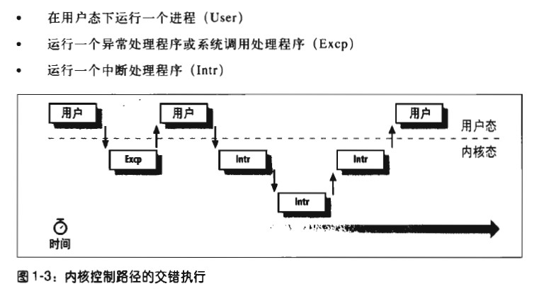
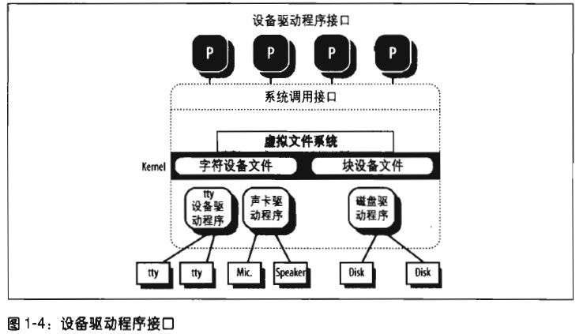

<!-- TOC -->

- [1. File](#1-file)
- [2. Hard link and soft(symbolic) link](#2-hard-link-and-softsymbolic-link)
    - [2.1 Hard link](#21-hard-link)
    - [2.2 Soft(symbolic) link](#22-softsymbolic-link)
- [3. File type](#3-file-type)
- [4. File description and index node(inode)](#4-file-description-and-index-nodeinode)
- [5. access permission and file mode](#5-access-permission-and-file-mode)
- [6. system call of file op](#6-system-call-of-file-op)
- [7. Unix kernel Introduction](#7-unix-kernel-introduction)
    - [7.1 User space and kernel space](#71-user-space-and-kernel-space)
    - [7.2 Process](#72-process)
    - [7.3 Reentrant kernel](#73-reentrant-kernel)
    - [7.4 Process address space](#74-process-address-space)
    - [7.5 Sync and lock](#75-sync-and-lock)
- [8. Signal and IPC](#8-signal-and-ipc)
- [9. Process manage](#9-process-manage)
- [10. Memory manage](#10-memory-manage)
- [11. Device driver(dd)](#11-device-driverdd)

<!-- /TOC -->
# 1. File

    at unix world all of the thing is file

# 2. Hard link and soft(symbolic) link

## 2.1 Hard link

_`# ln p1 p2`_

new p2 link to p1, both _p1_ _p2_ are the file, chang one another change too.

- can't pass two file system
- can't create hard link for directory

## 2.2 Soft(symbolic) link

> slove the above lacking of hard link

_`# ln -s p1 p2`_

# 3. File type

- regular file
- directory
- symbolic link
- pipe, named pipe(FIFO)
- block-oriented device file
- character-oriented device file
- socket

# 4. File description and index node(inode)

File not have the attribute infomation like file lens and EOF(end-of-file).
Fs(File system) save those in inode structure, all of file have there own inode.
fs use inode to locate file.

Fs must provide the attributes of file by POSIX
- file type
- number of hard link
- file length (byte)
- device description(which include the file)
- the node number to locate file in fs
- file owner id
- file owner group id
- several time-stamp to show node change time, last access time, last modify time
- access permission and file mode

# 5. access permission and file mode

There are three type about user:
- user of file owner
- same group user without owner
- other user

all of them have three permission read,write,exec 4 2 1 rwx
and append mark, suid(Set User ID), sgid(Set Group ID).

# 6. system call of file op

`FILE fd = fopen(path, mode);`

```shell
# man fopen
NAME
       fopen, fdopen, freopen - stream open functions

SYNOPSIS
       #include <stdio.h>

       FILE *fopen(const char *path, const char *mode);

       FILE *fdopen(int fd, const char *mode);

       FILE *freopen(const char *path, const char *mode, FILE *stream);

   Feature Test Macro Requirements for glibc (see feature_test_macros(7)):

       fdopen(): _POSIX_C_SOURCE >= 1 || _XOPEN_SOURCE || _POSIX_SOURCE

```

`lseek`
```shell
NAME
       lseek - reposition read/write file offset

SYNOPSIS
       #include <sys/types.h>
       #include <unistd.h>

       off_t lseek(int fd, off_t offset, int whence);

```

and so on

# 7. Unix kernel Introduction

## 7.1 User space and kernel space

From  user space to sink into kernel space by system call

Those several ways to enable kernel thread
- proccess call system call
- cpu throw out a exception when exec process
- device rasing a interrupt, kernel interrupt handler solve
- do kernel process

## 7.2 Process 

Process have there own process descriptor for manger process. When pause a process
will save the env about register
When restore the process will restore register.

## 7.3 Reentrant kernel



## 7.4 Process address space

mmap() map a part of file on block device to memeory

## 7.5 Sync and lock

spin-lock

# 8. Signal and IPC

Process can deal with the signal by ignore or deal asynchronous

# 9. Process manage

fork _exit new and exit a process

`fork()`

```shell
NAME
       fork - create a child process

SYNOPSIS
       #include <unistd.h>

       pid_t fork(void);

DESCRIPTION
       fork()  creates  a  new  process  by duplicating the calling process.  The new process, referred to as the child, is an exact duplicate of the
       calling process, referred to as the parent, except for the following points:
```

zombie process

process can use `wait4()` to wait another process of `waitpid()`

`wait4()`

```shell
NAME
       wait3, wait4 - wait for process to change state, BSD style

SYNOPSIS
       #include <sys/types.h>
       #include <sys/types.h>
       #include <sys/time.h>
       #include <sys/resource.h>
       #include <sys/wait.h>

       pid_t wait3(int *status, int options,
                   struct rusage *rusage);

       pid_t wait4(pid_t pid, int *status, int options,
                   struct rusage *rusage);

   Feature Test Macro Requirements for glibc (see feature_test_macros(7)):

       wait3():
           _BSD_SOURCE || _XOPEN_SOURCE >= 500 || _XOPEN_SOURCE && _XOPEN_SOURCE_EXTENDED
       wait4():
           _BSD_SOURCE

DESCRIPTION
       The  wait3()  and  wait4()  system  calls are similar to waitpid(2), but additionally return resource usage information about the child in the
       structure pointed to by rusage.

       Other than the use of the rusage argument, the following wait3() call:

           wait3(status, options, rusage);

       is equivalent to:

           waitpid(-1, status, options);

       Similarly, the following wait4() call:

           wait4(pid, status, options, rusage);

       is equivalent to:

           waitpid(pid, status, options);

       In other words, wait3() waits of any child, while wait4() can be used to select a specific child, or children, on which to wait.  See  wait(2)
       for further details.

       If  rusage is not NULL, the struct rusage to which it points will be filled with accounting information about the child.  See getrusage(2) for
       details.


```

`waitpid()`
```shell
NAME
       wait, waitpid, waitid - wait for process to change state

SYNOPSIS
       #include <sys/types.h>
       #include <sys/wait.h>

       pid_t wait(int *status);

       pid_t waitpid(pid_t pid, int *status, int options);

       int waitid(idtype_t idtype, id_t id, siginfo_t *infop, int options);

   Feature Test Macro Requirements for glibc (see feature_test_macros(7)):

       waitid():
           _SVID_SOURCE || _XOPEN_SOURCE >= 500 || _XOPEN_SOURCE && _XOPEN_SOURCE_EXTENDED
           || /* Since glibc 2.12: */ _POSIX_C_SOURCE >= 200809L

DESCRIPTION
       All  of these system calls are used to wait for state changes in a child of the calling process, and obtain information about the child whose state has changed.  A state change is considered to be:
       the child terminated; the child was stopped by a signal; or the child was resumed by a signal.  In the case of a terminated child, performing a wait allows the system to release the resources asso‐
       ciated with the child; if a wait is not performed, then the terminated child remains in a "zombie" state (see NOTES below).

       If  a  child  has  already changed state, then these calls return immediately.  Otherwise they block until either a child changes state or a signal handler interrupts the call (assuming that system
       calls are not automatically restarted using the SA_RESTART flag of sigaction(2)).  In the remainder of this page, a child whose state has changed and which has not yet been waited upon  by  one  of
       these system calls is termed waitable.

   wait() and waitpid()
       The wait() system call suspends execution of the calling process until one of its children terminates.  The call wait(&status) is equivalent to:

           waitpid(-1, &status, 0);

       The  waitpid()  system  call suspends execution of the calling process until a child specified by pid argument has changed state.  By default, waitpid() waits only for terminated children, but this
       behavior is modifiable via the options argument, as described below.
```


# 10. Memory manage

# 11. Device driver(dd)


