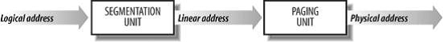

# Memory Addressing

## 1. Mermory Address

Three kinds of addresses:

- Logical address
- Linear address(virtual address)
- Physical address

MMU(Memory Management Unit) transforms a logical address into a linear address
Paging unit transforms thr linear address into a physical address

## 2. Segmentation in harware
