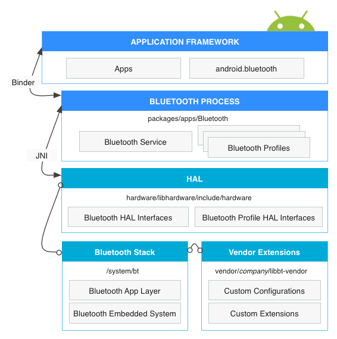
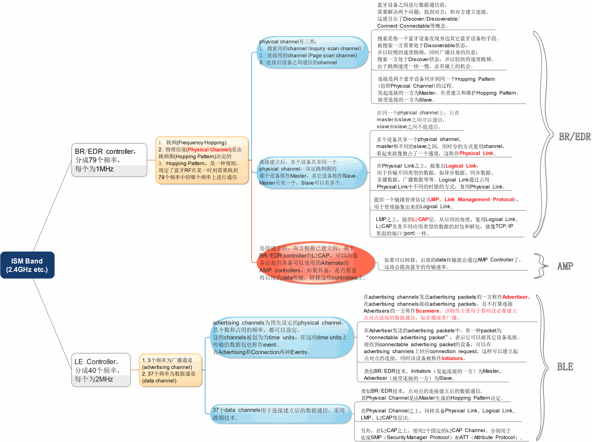
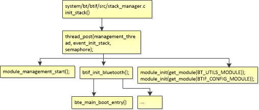
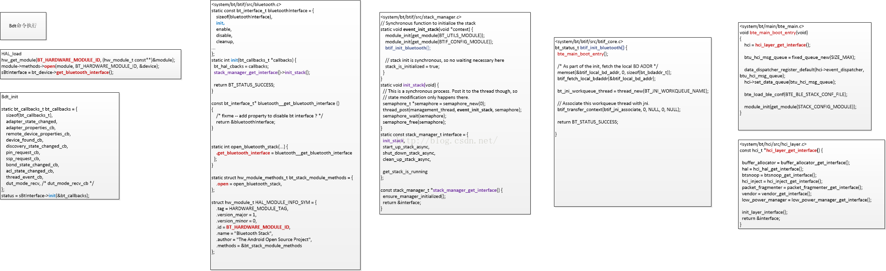
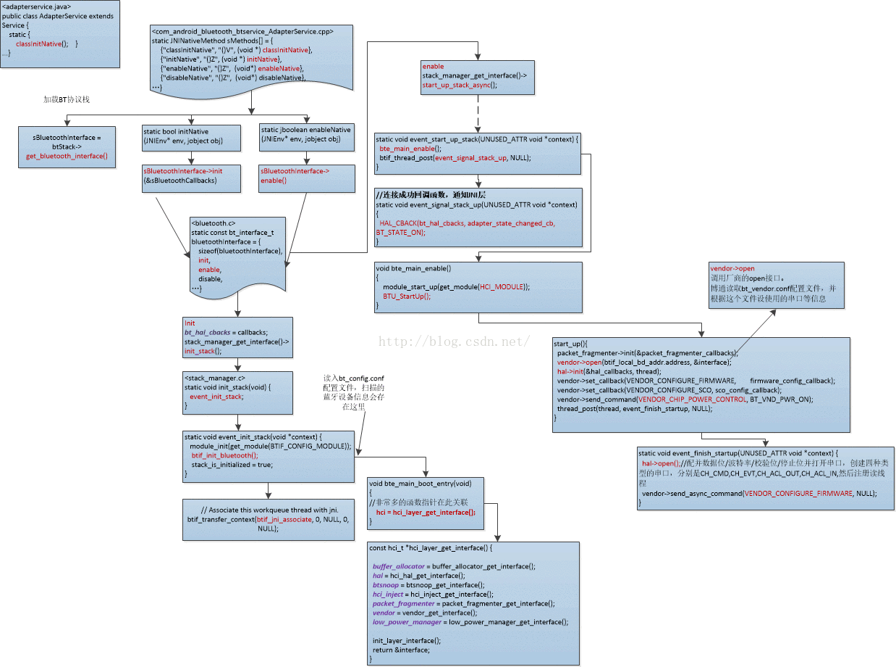
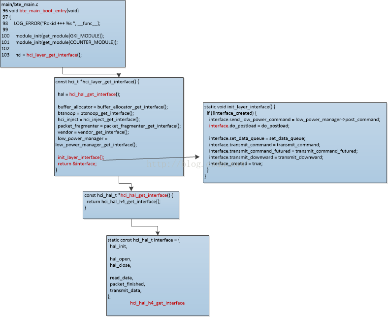

# 高通平台WiFi及BT概览

<!-- TOC -->

- [高通平台WiFi及BT概览](#%E9%AB%98%E9%80%9A%E5%B9%B3%E5%8F%B0wifi%E5%8F%8Abt%E6%A6%82%E8%A7%88)
    - [参考文档](#%E5%8F%82%E8%80%83%E6%96%87%E6%A1%A3)
- [WIFI](#wifi)
    - [1. WiFi基本目录](#1-wifi%E5%9F%BA%E6%9C%AC%E7%9B%AE%E5%BD%95)
    - [2. WiFi调通](#2-wifi%E8%B0%83%E9%80%9A)
    - [3. rc 中WiFi相关](#3-rc-%E4%B8%ADwifi%E7%9B%B8%E5%85%B3)
    - [4. WiFi架构](#4-wifi%E6%9E%B6%E6%9E%84)
        - [4.1. WifiStateMachine](#41-wifistatemachine)
        - [4.2. WifiNative内相关方法](#42-wifinative%E5%86%85%E7%9B%B8%E5%85%B3%E6%96%B9%E6%B3%95)
        - [4.3.  Wifi HAL](#43-wifi-hal)
        - [4.4. wpa_supplicant(hostapd) /external/wpa_supplicant_8](#44-wpasupplicanthostapd-externalwpasupplicant8)
        - [4.5. wireless module(in kernel)](#45-wireless-modulein-kernel)
        - [4.6. wlan driver](#46-wlan-driver)
    - [5. Wifi扫描](#5-wifi%E6%89%AB%E6%8F%8F)
    - [6. WiFi吞吐量标准](#6-wifi%E5%90%9E%E5%90%90%E9%87%8F%E6%A0%87%E5%87%86)
- [BT](#bt)
    - [参考资料](#%E5%8F%82%E8%80%83%E8%B5%84%E6%96%99)
    - [1. 蓝牙架构图](#1-%E8%93%9D%E7%89%99%E6%9E%B6%E6%9E%84%E5%9B%BE)
    - [2. 蓝牙协议 ：Basic Rate（BR）和Low Energy（LE）](#2-%E8%93%9D%E7%89%99%E5%8D%8F%E8%AE%AE-%EF%BC%9Abasic-rate%EF%BC%88br%EF%BC%89%E5%92%8Clow-energy%EF%BC%88le%EF%BC%89)
    - [3. 协议对比](#3-%E5%8D%8F%E8%AE%AE%E5%AF%B9%E6%AF%94)
    - [4. 源码分布](#4-%E6%BA%90%E7%A0%81%E5%88%86%E5%B8%83)
    - [5. bluedroid蓝牙子系统启动过程](#5-bluedroid%E8%93%9D%E7%89%99%E5%AD%90%E7%B3%BB%E7%BB%9F%E5%90%AF%E5%8A%A8%E8%BF%87%E7%A8%8B)
    - [6. bluedroid enable流程](#6-bluedroid-enable%E6%B5%81%E7%A8%8B)

<!-- /TOC -->

## 参考文档

- 80-YA512-1 WCN39xx WLAN/BT/FM Software Architecture Overview
- 80-Y8887-1SC WCN36x0 WLAN/BT/FM 平台开发指南
- 80-Y0476-12 WCNSS Android iwpriv IOCTLs Specification

# WIFI

## 1. WiFi基本目录

```
1、wifi用户空间的程序和库:

    external/wpa_supplicant/

    生成库libwpaclient.so和守护进程wpa_supplicant

2、wifi管理库
    hardware/libhardware_legary/wifi/

3、JNI部分：

    frameworks/base/core/jni/android_net_wifi_Wifi.cpp

4、JAVA部分：

    frameworks/base/services/java/com/android/server/

    frameworks/base/wifi/java/android/net/wifi/

5、WIFI Settings应用程序位于：

    packages/apps/Settings/src/com/android/settings/wifi/

6、WIFI 驱动模块  wlan.ko

    wpa_supplicant通过wireless_ext 接口和驱动通信

7、WIFI 硬件模块

```

## 2. WiFi调通

参考 `80-Y8887-1SC WCN36x0 WLAN/BT/FM 平台开发指南`

## 3. rc 中WiFi相关

```shell
# // init.rc
    mkdir /data/misc/wifi/sockets 0770 wifi wifi
    mkdir /data/misc/wifi/wpa_supplicant 0770 wifi wifi
    mkdir /data/misc/ethernet 0770 system system
    mkdir /data/misc/dhcp 0770 dhcp dhcp
    mkdir /data/misc/user 0771 root root
    mkdir /data/misc/perfprofd 0775 root root
    # give system access to wpa_supplicant.conf for backup and restore
    chmod 0660 /data/misc/wifi/wpa_supplicant.conf

    on boot
    # basic network init
    ifup lo
    hostname localhost
    domainname localdomai
```

```shell
# // init.qcom.rc
    # Create the directories used by the Wireless subsystem
    mkdir /data/misc/wifi 0770 wifi wifi
    mkdir /data/misc/wifi/sockets 0770 wifi wifi
    mkdir /data/misc/wifi/wpa_supplicant 0770 wifi wifi
    mkdir /data/misc/dhcp 0770 dhcp dhcp
    chown dhcp dhcp /data/misc/dhcp

    on property:init.svc.wpa_supplicant=stopped
    stop dhcpcd

#   wpa启动
service p2p_supplicant /system/bin/wpa_supplicant \
    -ip2p0 -Dnl80211 -c/data/misc/wifi/p2p_supplicant.conf \
    -I/system/etc/wifi/p2p_supplicant_overlay.conf -N \
    -iwlan0 -Dnl80211 -c/data/misc/wifi/wpa_supplicant.conf \
    -I/system/etc/wifi/wpa_supplicant_overlay.conf \
    -O/data/misc/wifi/sockets -puse_p2p_group_interface=1 -dd \
    -e/data/misc/wifi/entropy.bin -g@android:wpa_wlan0
#   we will start as root and wpa_supplicant will switch to user wifi
#   after setting up the capabilities required for WEXT
#   user wifi
#   group wifi inet keystore
    class main
    socket wpa_wlan0 dgram 660 wifi wifi
    disabled
    oneshot

# setprop ctl.start wpa_supplicant 也会执行
service wpa_supplicant /system/bin/wpa_supplicant \
    -iwlan0 -Dnl80211 -c/data/misc/wifi/wpa_supplicant.conf \
    -I/system/etc/wifi/wpa_supplicant_overlay.conf \
    -O/data/misc/wifi/sockets -dd \
    -e/data/misc/wifi/entropy.bin -g@android:wpa_wlan0
    #   we will start as root and wpa_supplicant will switch to user wifi
    #   after setting up the capabilities required for WEXT
    #   user wifi
    #   group wifi inet keystore
    class main
    socket wpa_wlan0 dgram 660 wifi wifi
    disabled
    oneshot
```

## 4. WiFi架构

### 4.1. WifiStateMachine
    各个功能的切换其实就是在状态机之间进行各个状态切换.

### 4.2. WifiNative内相关方法

>WifiNative是`system_server` 和 `wpa_supplicant` 对话的窗口，实际上主要依靠wpa_supplicant项目编译出来的动态库libwpa_client.so。

```java
//frameworks/base/core/jni/android_net_wifi_WifiNative.cpp
static JNINativeMethod gWifiMethods[] = {
    /* name, signature, funcPtr */
    { "loadDriver", "()Z",  (void *)android_net_wifi_loadDriver },
    { "isDriverLoaded", "()Z",  (void *)android_net_wifi_isDriverLoaded },
    { "unloadDriver", "()Z",  (void *)android_net_wifi_unloadDriver },
    { "startSupplicant", "(ZI)Z",  (void *)android_net_wifi_startSupplicant },
    { "killSupplicant", "(Z)Z",  (void *)android_net_wifi_killSupplicant },
    { "connectToSupplicantNative", "()Z", (void *)android_net_wifi_connectToSupplicant },
    { "closeSupplicantConnectionNative", "()V", (void *)android_net_wifi_closeSupplicantConnection },
    { "waitForEventNative", "()Ljava/lang/String;", (void*)android_net_wifi_waitForEvent },
    { "doBooleanCommandNative", "(Ljava/lang/String;)Z", (void*)android_net_wifi_doBooleanCommand },
    { "doIntCommandNative", "(Ljava/lang/String;)I", (void*)android_net_wifi_doIntCommand },
    { "doStringCommandNative", "(Ljava/lang/String;)Ljava/lang/String;", (void*) android_net_wifi_doStringCommand },
    { "setMaxTxPower", "(IZ)Z",  (void *)android_net_wifi_setMaxTxPower },
};
```

### 4.3.  Wifi HAL

```cpp
        2 // 驱动相关
	    3 int wifi_load_driver();
	    4 int wifi_unload_driver();
	    5 int is_wifi_driver_loaded();
	    6 
	    7 // supplicant:
	    8 int wifi_start_supplicant(int p2pSupported, int first_scan_delay);
	    9 int wifi_stop_supplicant(int p2pSupported);
	   10 int wifi_connect_to_supplicant();
	   11 void wifi_close_supplicant_connection();
	   12 
	   13 //等待wifi事件发生,阻塞直到等到事件,返回事件
	   14 int wifi_wait_for_event(char *buf, size_t len);
	   15 
	   16 //向wifi驱动发一个命令
	   17 int wifi_command(const char *command, char *reply, size_t *reply_len);
	   18 
	   19 // 发起一dhcp请求
	   20 int do_dhcp_request(int *ipaddr, int *gateway, int *mask,
	   21                                       int *dns1, int *dns2, int *server, int *lease);
	   22 
	   23 // 返回一个do_dhcp_request()的错误字符串
	   24 const char *get_dhcp_error_string();
	   25 
	   26 #define WIFI_GET_FW_PATH_STA    0
	   27 #define WIFI_GET_FW_PATH_AP     1
	   28 #define WIFI_GET_FW_PATH_P2P    2
	   29 
	   30 // 返一个请的firmware路径
	   31 const char *wifi_get_fw_path(int fw_type);
	   32 
	   33 // 为wlan驱动改变firmware路径
	   34 int wifi_change_fw_path(const char *fwpath);
	   35 
	   36 #define WIFI_ENTROPY_FILE   "/data/misc/wifi/entropy.bin"
	   37 

```

### 4.4. wpa_supplicant(hostapd) /external/wpa_supplicant_8

> 都在`externl/wpa_supplicant_8`，wpa是在客户端模式下，hostapd是ap模式。通过socket与内核通信
  wpa_supplicant适配层是通用的wpa_supplicant的封装，在Android中作为WIFI部分的硬件抽象层(HAL)来使用。
  wpa_supplicant适配层主要用于封装与wpa_supplicant守护进程的通信，以提供给Android框架使用。它实现了加载，控制和消息监控等功能。
  wpa根据命令，下发不同的cmd到nl80211，nl80211来调用驱动的相关功能。

```c
// 打开一个socket与wpa或者hostapd通信
struct wpa_ctrl * wpa_ctrl_open(const char *ctrl_path);

// Close a control interface to wpa_supplicant/hostapd
void wpa_ctrl_close(struct wpa_ctrl *ctrl);

// Send a command to wpa_supplicant/hostapd
// 在wpa中有相关的处理函数
int wpa_ctrl_request(struct wpa_ctrl *ctrl, const char *cmd, size_t cmd_len,
             char *reply, size_t *reply_len,
             void (*msg_cb)(char *msg, size_t len));

// Register as an event monitor for the control interface
int wpa_ctrl_attach(struct wpa_ctrl *ctrl);

// Unregister event monitor from the control interface
int wpa_ctrl_detach(struct wpa_ctrl *ctrl);

// Receive a pending control interface message
int wpa_ctrl_recv(struct wpa_ctrl *ctrl, char *reply, size_t *reply_len);

// Check whether there are pending event messages
int wpa_ctrl_pending(struct wpa_ctrl *ctrl);

// Get file descriptor used by the control interface
int wpa_ctrl_get_fd(struct wpa_ctrl *ctrl);

char * wpa_ctrl_get_remote_ifname(struct wpa_ctrl *ctrl);
```

### 4.5. wireless module(in kernel)

>从wpa下发的相关命令，然后调用对应的`.doit`比如cmd `NL80211_CMD_TRIGGER_SCAN` 对于的`nl80211_trigger_scan`。

```c
static const struct genl_ops nl80211_ops[] = {
    ···
    {
		.cmd = NL80211_CMD_TRIGGER_SCAN,
		.doit = nl80211_trigger_scan,
		.policy = nl80211_policy,
		.flags = GENL_ADMIN_PERM,
		.internal_flags = NL80211_FLAG_NEED_WDEV_UP |
				  NL80211_FLAG_NEED_RTNL,
	},
	{
		.cmd = NL80211_CMD_ABORT_SCAN,
		.doit = nl80211_abort_scan,
		.policy = nl80211_policy,
		.flags = GENL_ADMIN_PERM,
		.internal_flags = NL80211_FLAG_NEED_WDEV_UP |
				  NL80211_FLAG_NEED_RTNL,
	},
	{
		.cmd = NL80211_CMD_GET_SCAN,
		.policy = nl80211_policy,
		.dumpit = nl80211_dump_scan,
	},
    ···
```

### 4.6. wlan driver
> `vendor/qcom/opensource/wlan/prima`

模块初始化(module_init)，模块退出(module_exit)：
CORE/HDD/src/wlan_hdd_main.c

模型：
多线程 + 队列

创建内核线程：
CORE/VOSS/src/vos_sched.c 的 vos_sched_open()

线程任务(vos_sched.c)：
* VosMcThread() - The VOSS Main Controller thread
* VosWdThread() - The VOSS Watchdog thread
* VosTXThread() - The VOSS Main Tx thread
* VosRXThread() - The VOSS Main Rx thread

## 5. Wifi扫描

```cpp
/* 从上层Wif状态机通过状态切换下发scan请求
 * 通过socket发送到wpa
 * nl80211通过调用对应的function来完成操作
 * CMD : NL80211_CMD_TRIGGER_SCAN
 */

wifi –> WifiService

WifiService extends IWifiManager.Stub

IWifiManager.Stub extends android.os.Binder
    implements android.net.wifi.IWifiManager

-> IWifiManager.Stub.onTransact(int code, Parcel data, Parcel reply, int flags);
    case TRANSACTION_startScan:
-> WifiService.startScan(WorkSource workSource);
-> WifiStateMachine.startScan(int callingUid, WorkSource workSource);
-> StateMachine.sendMessage(CMD_START_SCAN, callingUid, 0, workSource);
    case CMD_START_SCAN:
->  handleScanRequest(WifiNative.SCAN_WITHOUT_CONNECTION_SETUP, message);
->  startScanNative(type, freqs)
-> WifiNative.scan(type, freqs)
->  doBooleanCommand("SCAN ..."); // AF_UNIX socket, send to wpa_supplicant

// wpa_supplicant

// refer to ./ctrl_iface.c:6986

    } else if (os_strcmp(buf, "SCAN") == 0) {
        wpas_ctrl_scan(wpa_s, NULL, reply, reply_size, &reply_len);
    } else if (os_strncmp(buf, "SCAN ", 5) == 0) {
        wpas_ctrl_scan(wpa_s, buf + 5, reply, reply_size, &reply_len);


// wpas_ctrl_scan -> wpa_supplicant_req_scan

    int res = eloop_deplete_timeout(sec, usec, wpa_supplicant_scan, wpa_s,
                    NULL);
    if (res == 1) {
        wpa_dbg(wpa_s, MSG_DEBUG, "Rescheduling scan request: %d.%06d sec",
            sec, usec);
    }


// wpa_supplicant_scan -> wpa_supplicant_trigger_scan

-> radio_add_work(wpa_s, 0, "scan", 0, wpas_trigger_scan_cb, ctx)


// wpas_trigger_scan_cb -> wpa_drv_scan

static inline int wpa_drv_scan(struct wpa_supplicant *wpa_s,
                   struct wpa_driver_scan_params *params)
{
    if (wpa_s->driver->scan2) // callback
        return wpa_s->driver->scan2(wpa_s->drv_priv, params);
    return -1;
}

// refer to ./src/drivers/driver_nl80211.c:12612

driver_nl80211_scan2 -> wpa_driver_nl80211_scan

    msg = nl80211_scan_common(drv, NL80211_CMD_TRIGGER_SCAN, params,
                  bss->wdev_id_set ? &bss->wdev_id : NULL);
    if (!msg)
        return -1;

// nl80211

	{
		.cmd = NL80211_CMD_TRIGGER_SCAN,
		.doit = nl80211_trigger_scan,
		.policy = nl80211_policy,
		.flags = GENL_ADMIN_PERM,
		.internal_flags = NL80211_FLAG_NEED_WDEV_UP |
				  NL80211_FLAG_NEED_RTNL,
	},

static int nl80211_trigger_scan(struct sk_buff *skb, struct genl_info *info)
{
···
    err = rdev_scan(rdev, request);
···
}

static inline int rdev_scan(struct cfg80211_registered_device *rdev,
			    struct cfg80211_scan_request *request)
{
	int ret;
	trace_rdev_scan(&rdev->wiphy, request);
	ret = rdev->ops->scan(&rdev->wiphy, request); //调用到驱动内的扫描
	trace_rdev_return_int(&rdev->wiphy, ret);
	return ret;
}
```

## 6. WiFi吞吐量标准

|协议|标准频宽|实际速度（标准）|实际速度（最大）|
|--------|--------|--------|--------|
|802.11b|2.4-2.5 GHz|6.5 Mbit/s|11 Mbit/s|
|802.11g|2.4-2.5 GHz|25 Mbit/s|54 Mbit/s|
|802.11n|2.4 GHz or 5 GHz bands|300 Mbit/s（20MHz*4 MIMO）|600 Mbit/s（40MHz*4 MIMO）|
|802.11ac|5 GHz|433Mbit/s, 867Mbit/s（80MHz，160MrHz为可选）|867Mbit/s, 1.73 Gbit/s, 3.47 Gbit/s, 6.93 Gbit/s（8 MIMO，160MHz）|

---
# BT

## 参考资料
BT Android官方介绍

https://source.android.google.cn/devices/bluetooth

BT相关文章

http://blog.csdn.net/shichaog/article/category/6445694

http://www.wowotech.net/sort/bluetooth

## 1. 蓝牙架构图



## 2. 蓝牙协议 ：Basic Rate（BR）和Low Energy（LE）
>两种完全不同的协议

## 3. 协议对比



## 4. 源码分布

```shell
# 1. 核心服务
    frameworks/base/services/core/java/com/android/server/Bluetooth
    BluetoothManagerService.java  BluetoothService.java

# 2. application & framework
    packages/apps/Bluetooth/src/com/android/bluetooth/
    ├── a2dp
    ├── avrcp
    ├── BluetoothObexTransport.java
    ├── btservice
    ├── gatt
    ├── hdp
    ├── hfp
    ├── hfpclient
    ├── hid
    ├── IObexConnectionHandler.java
    ├── map
    ├── ObexRejectServer.java
    ├── ObexServerSockets.java
    ├── OolConnManager.java
    ├── opp
    ├── pan
    ├── pbap
    ├── sap
    ├── sdp
    ├── SignedLongLong.java
    ├── util
    └── Utils.java

#

```

## 5. bluedroid蓝牙子系统启动过程

>init进程启动-->Native服务启动-->System server,Android服务启动-->Home启动


1. rc

    ```shell
    # init.rc
        mkdir /data/misc/bluedroid 02770 bluetooth net_bt_stack
        # Fix the access permissions and group ownership for 'bt_config.conf'
        chmod 0660 /data/misc/bluedroid/bt_config.conf
        chown bluetooth net_bt_stack /data/misc/bluedroid/bt_config.conf
        mkdir /data/misc/bluetooth 0770 system system
        mkdir /data/misc/keystore 0700 system system
        mkdir /data/misc/gatekeeper 0700 system system
        mkdir /data/misc/keychain 0771 system system
    # init.qcom.rc
    on boot
        chown bluetooth bluetooth /sys/module/bluetooth_power/parameters/power
        chown bluetooth bluetooth /sys/class/rfkill/rfkill0/type
        chown bluetooth bluetooth /sys/class/rfkill/rfkill0/state
        chown bluetooth bluetooth /proc/bluetooth/sleep/proto
        chown bluetooth bluetooth /sys/module/hci_uart/parameters/ath_lpm
        chown bluetooth bluetooth /sys/module/hci_uart/parameters/ath_btwrite
        chown system system /sys/module/sco/parameters/disable_esco
        chown bluetooth bluetooth /sys/module/hci_smd/parameters/hcismd_set
        chmod 0660 /sys/module/bluetooth_power/parameters/power
        chmod 0660 /sys/module/hci_smd/parameters/hcismd_set
        chmod 0660 /sys/class/rfkill/rfkill0/state
        chmod 0660 /proc/bluetooth/sleep/proto
        chown bluetooth bluetooth /dev/ttyHS0
        chmod 0660 /sys/module/hci_uart/parameters/ath_lpm
        chmod 0660 /sys/module/hci_uart/parameters/ath_btwrite
        chmod 0660 /dev/ttyHS0
        chown bluetooth bluetooth /sys/devices/platform/msm_serial_hs.0/clock
        chmod 0660 /sys/devices/platform/msm_serial_hs.0/clock
        chmod 0777 /sys/lcd_te/te_state
        chmod 0660 /dev/ttyHS2
        chown bluetooth bluetooth /dev/ttyHS2

        chown bluetooth bluetooth /sys/class/rfkill/rfkill0/device/extldo
        chmod 0660 /sys/class/rfkill/rfkill0/device/extldo

        #Create QMUX deamon socket area
        mkdir /dev/socket/qmux_radio 0770 radio radio
        chmod 2770 /dev/socket/qmux_radio
        mkdir /dev/socket/qmux_audio 0770 media audio
        chmod 2770 /dev/socket/qmux_audio
        mkdir /dev/socket/qmux_bluetooth 0770 bluetooth bluetooth
        chmod 2770 /dev/socket/qmux_bluetooth
        mkdir /dev/socket/qmux_gps 0770 gps gps
        chmod 2770 /dev/socket/qmux_gps
        ···
    service start_hci_filter /system/bin/wcnss_filter
        class late_start
        user root
        group bluetooth qcom_diag
        disabled

    service config_bluetooth /system/bin/sh /system/etc/init.qcom.bt.sh "onboot"
        class core
        user root
        oneshot

    service hciattach /system/bin/sh /system/etc/init.qcom.bt.sh
        class late_start
        user bluetooth
        group bluetooth net_bt_admin
        disabled
        oneshot

    on property:bluetooth.hciattach=true
        start hciattach

    on property:bluetooth.hciattach=false
        setprop bluetooth.status off

    service hciattach_ath3k /system/bin/sh /system/etc/init.ath3k.bt.sh
        class late_start
        user bluetooth
        group system bluetooth net_bt_admin misc
        disabled
        oneshot

    service bt-dun /system/bin/dun-server /dev/smd7 /dev/rfcomm0
        class late_start
        user bluetooth
        group bluetooth net_bt_admin inet
        disabled
        oneshot

    service bt-sap /system/bin/sapd 15
        user bluetooth
        group bluetooth net_bt_admin
        class late_start
        disabled
        oneshot

    service btsnoop /system/bin/btsnoop
    user bluetooth
    group bluetooth net_bt_admin sdcard_rw sdcard_r
    class late_start
    disabled
    oneshot

    service ftmd /system/bin/logwrapper /system/bin/ftmdaemon
        class late_start
        user root
        group bluetooth net_bt_admin misc net_bt_stack qcom_diag
        disabled
        oneshot
        ···
    # QMUX must be in multiple groups to support external process connections
    service qmuxd /system/bin/qmuxd
        class main
        user root
        group radio audio bluetooth gps qcom_diag
        disabled
        ···
    service btwlancoex /system/bin/sh /system/etc/init.qcom.coex.sh
        class late_start
        user bluetooth
        group bluetooth net_bt_admin inet net_admin net_raw
        disabled
        oneshot

        ···
    service hcidump /system/bin/sh /system/etc/hcidump.sh
        user bluetooth
        group bluetooth system net_bt_admin net_admin
        disabled
        oneshot
        ···
    ```

2.  init 实现

	```c
    //system/bt/btif/src/stack_manager.c
    /*
     *同步法，该函数退出时，event_init_stack这个线程的工作也会完成
     */
    63 static void init_stack(void) {
    64   // This is a synchronous process. Post it to the thread though, so
    65   // state modification only happens there.
    66   semaphore_t *semaphore = semaphore_new(0);
    //new thread calll event_init_stack function
    67   thread_post(management_thread, event_init_stack, semaphore); // 2!!!!
    68   semaphore_wait(semaphore);
    69   semaphore_free(semaphore);
    70 }

    ···
    // thread call event_init_stack funtion!!!!
    91 static void event_init_stack(void *context) {  //3!!!!!!
    92   semaphore_t *semaphore = (semaphore_t *)context;
    93
    94   if (!stack_is_initialized) {
    95     module_management_start();
    96
    97     module_init(get_module(BT_UTILS_MODULE));
    98     module_init(get_module(BTIF_CONFIG_MODULE));
    99     btif_init_bluetooth();      #TODO// 4  !!!!!important
    100
    101     // stack init is synchronous, so no waiting necessary here
    102     stack_is_initialized = true;
    103   }
    104
    105   if (semaphore)
    106     semaphore_post(semaphore);
    107 }
    ···
    206 static void ensure_manager_initialized(void) {
    207   if (management_thread)
    208     return;
    209
    210   management_thread = thread_new("stack_manager");
    211   if (!management_thread) {
    212     LOG_ERROR("%s unable to create stack management thread.", __func__);
    213     return;
    214   }
    215 }

    217 static const stack_manager_t interface = {
    218   init_stack, /*init_stack interface*/
    219   start_up_stack_async,
    220   shut_down_stack_async,
    221   clean_up_stack_async,
    222
    223   get_stack_is_running
    224 };
    //get interface!!
    226 const stack_manager_t *stack_manager_get_interface() {
    227   ensure_manager_initialized();
    228   return &interface;
    229 }


    // system/bt/btif/src/bluetooth.c
    145 /*************************************************
    146 **
    147 **   BLUETOOTH HAL INTERFACE FUNCTIONS
    148 **
    149 **************************************************/
    150
    151 static int init(bt_callbacks_t *callbacks) {
    152   LOG_INFO("%s", __func__);
    153
    154   if (interface_ready())
    155     return BT_STATUS_DONE;
    156
    157 #ifdef BLUEDROID_DEBUG
    158   allocation_tracker_init();
    159 #endif
    160
    161   bt_hal_cbacks = callbacks;
    162   stack_manager_get_interface()->init_stack(); // 1
    163   btif_debug_init();
    164   return BT_STATUS_SUCCESS;
    165 }
    ```

    
    >init 调用图

## 6. bluedroid enable流程

>初始化流程上是先由协议栈调用vendor的接口，即op接口完成的功能包括，芯片上电，firmware配置，串口打开并设置，低功耗使能等，而vendor接口会在初始化过程中调用回调相关回调函数通知上层蓝牙所处的状态，在HCI层通过线程的方式收到命令后，会进一步调用JNI层的方法通知蓝牙service，相关蓝牙状态的情况

1. 使用bdt enable

    ```shell
    root@msm8909_512:/ # bdt
    bdt
    set_aid_and_cap : pid 8666, uid 0 gid 0

    :::::::::::::::::::::::::::::::::::::::::::::::::::
    :: Bluedroid test app starting
    Loading HAL lib + extensions
    HAL library loaded (Success)
    INIT BT
    HAL REQUEST SUCCESS
    >enable
    enable
    ENABLE BT
    HAL REQUEST SUCCESS
    >ADAPTER STATE UPDATED : ON

    ```

    >bdt 命令触发的调用

    

2. 调用bdt_enable

    ```c
        void bdt_enable(void)
        {
            bdt_log("<strong>ENABLE BT</strong>");
            if (bt_enabled) {
                bdt_log("Bluetooth is already enabled");
                return;
            }
            status = sBtInterface->enable();

            check_return_status(status);
        }
    ```

    

3. vendor向HCI层发送命令

    ```c
    // Called back from vendor library when it wants to send an HCI command.
    static uint8_t transmit_cb(UNUSED_ATTR uint16_t opcode, void *buffer, tINT_CMD_CBACK callback) {
    assert(hci != NULL);
    hci->transmit_command((BT_HDR *)buffer, transmit_completed_callback, NULL, callback);
    return true;
    }

    // hci的位置
    static bool vendor_open(
        const uint8_t *local_bdaddr,
        const hci_t *hci_interface) {
    assert(lib_handle == NULL);
    hci = hci_interface;

    // 加载HCI module会调用module_start_up(get_module(HCI_MODULE)); 然后调用HCI module start_up
    static void init_layer_interface() {
    if (!interface_created) {
        interface.send_low_power_command = low_power_manager->post_command;
        interface.do_postload = do_postload;

        // It's probably ok for this to live forever. It's small and
        // there's only one instance of the hci interface.
        interface.event_dispatcher = data_dispatcher_new("hci_layer");
        if (!interface.event_dispatcher) {
        LOG_ERROR("%s could not create upward dispatcher.", __func__);
        return;
        }

        interface.set_data_queue = set_data_queue;
        interface.transmit_command = transmit_command;
        interface.transmit_command_futured = transmit_command_futured;
        interface.transmit_downward = transmit_downward;
        interface_created = true;
    }

    static future_t *start_up(void) {
    vendor->open(btif_local_bd_addr.address, &interface);
    }

    ```

    

4. 使用线程来传输数据

    ```c
    <hci_layer.c>
    static future_t *start_up(void) {
    ...
    thread = thread_new("hci_thread");
    ...
    fixed_queue_register_dequeue(command_queue, thread_get_reactor(thread), event_command_ready, NULL);
    fixed_queue_register_dequeue(packet_queue, thread_get_reactor(thread), event_packet_ready, NULL);
    ...
    }
    ```

5. hci->transmit_command

    ```c
    // hci->transmit_command((BT_HDR *)buffer, transmit_completed_callback, NULL, callback);
    static void transmit_command(
        BT_HDR *command,
        command_complete_cb complete_callback,
        command_status_cb status_callback,
        void *context) {
        waiting_command_t *wait_entry = osi_calloc(sizeof(waiting_command_t));

    //命令填充
        uint8_t *stream = command->data + command->offset;
        STREAM_TO_UINT16(wait_entry->opcode, stream);
        wait_entry->complete_callback = complete_callback;
        wait_entry->status_callback = status_callback;
        wait_entry->command = command;
        wait_entry->context = context;

        // Store the command message type in the event field
        // in case the upper layer didn't already
        command->event = MSG_STACK_TO_HC_HCI_CMD;

    /* command_queue是上一小段刚刚介绍到的命令队列，wait_entry是command填充数据结构体。
     *下面函数就是将填充好的命令放在等待队列上。
     */
        fixed_queue_enqueue(command_queue, wait_entry);
    }
    ```

6. op命令

    ```c
    // libbt-vendor/src/bt_vendor_qcom.c
    // 例如协议栈调用vendor的op命令来加载firmware
    case BT_VND_OP_FW_CFG:
    697             {
    698                 // call hciattach to initalize the stack
    699                 if(bt_vendor_cbacks){
    700                    if (btSocType ==  BT_SOC_ROME) {
    701                        if (is_soc_initialized()) {
    702                            ALOGI("Bluetooth FW and transport layer are initialized");
    703                            bt_vendor_cbacks->fwcfg_cb(BT_VND_OP_RESULT_SUCCESS);
    704                        } else {
    705                            ALOGE("bt_vendor_cbacks is null or SoC not initialized");
    706                            ALOGE("Error : hci, smd initialization Error");
    707                            retval = -1;
    708                        }
    709                    } else {
    710                        ALOGI("Bluetooth FW and transport layer are initialized");
    711                        bt_vendor_cbacks->fwcfg_cb(BT_VND_OP_RESULT_SUCCESS);
    712                    }
    713                 }
    714                 else{
    715                    ALOGE("bt_vendor_cbacks is null");
    716                    ALOGE("Error : hci, smd initialization Error");
    717                    retval = -1;
    718                 }
    719             }

    // open off case
    659         case BT_VND_OP_POWER_CTRL:
    660             {
    661                 nState = *(int *) param;
    662                 ALOGI("bt-vendor : BT_VND_OP_POWER_CTRL: %s",
    663                         (nState == BT_VND_PWR_ON)? "On" : "Off" );
    664
    665                 switch(btSocType)
    666                 {
    667                     case BT_SOC_DEFAULT:
    668                         if (readTrpState())
    669                         {
    670                            ALOGI("bt-vendor : resetting BT status");
    671                            hw_config(BT_VND_PWR_OFF);
    672                         }
    673                         retval = hw_config(nState);
    674                         if(nState == BT_VND_PWR_ON
    675                            && retval == 0
    676                            && is_hw_ready() == TRUE){
    677                             retval = 0;
    678                         }
    679                         else {
    680                             retval = -1;
    681                         }
    682                         break;
    683                     case BT_SOC_ROME:
    684                     case BT_SOC_AR3K:
    685                         /* BT Chipset Power Control through Device Tree Node */
    686                         if(!pthread_mutex_lock(&m_lock)) {
    687                             retval = bt_powerup(nState);
    688                             pthread_mutex_unlock(&m_lock);
    689                         }
    690                     default:
    691                         break;
    692                 }
    693             }
    694             break;
    ```

7. hw_config

    ```c
    45 int hw_config(int nState)
    46 {
    47     char *szState[] = {"true", "false"};
    48     char *szReqSt = NULL;
    49     char szBtSocStatus[PROPERTY_VALUE_MAX] = {'\0', };
    50
    51     if(nState == BT_VND_PWR_OFF)
    52         szReqSt = szState[1];
    53     else
    54         szReqSt = szState[0];
    55
    56     if((property_get("bluetooth.status", szBtSocStatus, "") <= 0))
    57     {
    58        if(nState == BT_VND_PWR_ON ) {
    59           ALOGW("Hw_config: First Time BT on after boot.Starting hciattach daemon BTStatus=%s",
                            szBtSocStatus);
    60           if (property_set("bluetooth.hciattach", szReqSt) < 0)
    61           {
    62               ALOGE("Hw_config: Property Setting fail");
    63               return -1;
    64           }
    65        }
    66     } else if( !(strncmp(szBtSocStatus, "on", strlen("on")))) {
    67           //BTSOC is already on
    68           ALOGW("Hw_config: nState = %d", nState);
    69     } else {
    70           ALOGW("Hw_config: trigerring hciattach");
    71           if (property_set("bluetooth.hciattach", szReqSt) < 0)
    72           {
    73               ALOGE("Hw_config: Property Setting fail");
    74               return -1;
    75           }
    76     }
    77
    78     return 0;
    79 }
    ```